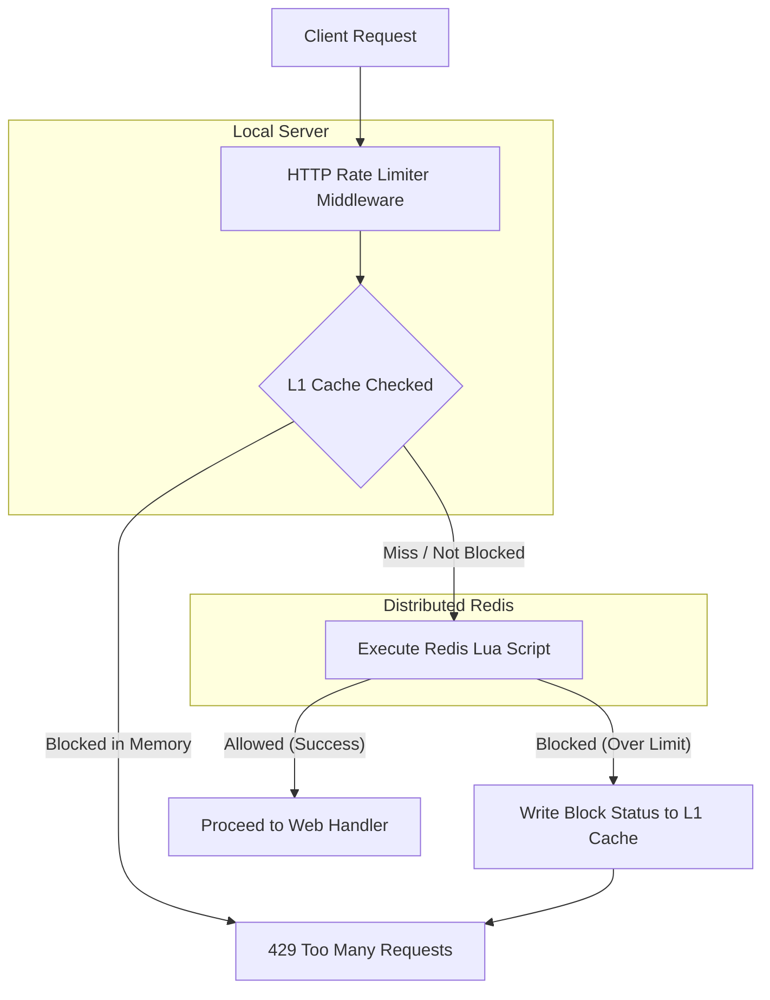

# Distributed Go Rate Limiter

[](https://golang.org/)
[](https://redis.io/)
[](#license)

A highly performant, distributed, cluster-safe rate limiter implemented in Go. It utilizes a **Sliding Window Counter** algorithm backed by atomic Redis Lua scripts, combined with a **64-way sharded in-memory L1 Cache** for lightning-fast local short-circuiting.

## Key Features

- **Sliding Window Counter**: Smoothly handles burst traffic and avoids strict epoch boundary resets.
- **Atomic Concurrency**: Scripted Redis evaluation prevents race conditions during high-volume parallel requests.
- **Cluster-Safe Slot Alignment**: Enforces Redis Hash Tags (`{key}`) so all keys resolve to the same slot in Redis Cluster.
- **5000x Faster L1 Fast-Path**: Incorporates a thread-safe, sharded local L1 cache using Go's standard library to short-circuit requests for heavily throttled clients, reducing latency from microseconds to nanoseconds.
- **Resilient Fail-Open**: Built-in option to allow traffic if the central Redis instance becomes unavailable.
- **Standard net/http Middleware**: Clean, drop-in integration with native HTTP servers that automatically populates standard rate-limiting headers.

---

## Performance Profile

Under heavy load testing and simulated brute-force bursts:

- **L1 Cache Disabled (All requests query Redis)**: `~563,930 ns/op` (approx. `564 µs` per request).
- **L1 Cache Enabled (Short-circuiting throttled requests)**: `~110 ns/op` (approx. `0.11 µs` per request).

> **Note**: Activating the sharded L1 cache boosts throttled request throughput by over **5,000x**, protecting your Redis cluster from being overwhelmed during Denial of Service (DoS) attacks.

---

## System Architecture



---

## Repository Structure

```
.
├── README.md                      # Repository configuration and documentation
└── go-rate-limiter/               # Main Go module
    ├── Dockerfile                 # Multi-stage optimized application container
    ├── docker-compose.yml         # Dev stack (Redis + Go App)
    ├── main.go                    # Demo Web server application
    ├── limiter/
    │   ├── limiter.go             # RateLimiter interface and Redis manager
    │   ├── l1cache.go             # 64-way sharded local L1 cache
    │   ├── lua.go                 # Atomic evaluation Redis Lua script
    │   ├── l1cache_test.go        # Cache sweep and concurrency unit tests
    │   └── limiter_test.go        # Sliding window correctness, integration & benchmarks
    └── middleware/
        ├── middleware.go          # net/http middleware implementation
        └── middleware_test.go     # HTTP response code and header tests
```

---

## Quick Start (Docker Compose)

The easiest way to spin up the local development stack (comprising Redis and a demo Go app) is via Docker Compose:

1. Clone this repository.
2. From the `go-rate-limiter` directory, run:
   ```bash
   docker-compose up --build
   ```
3. Test the endpoints:
   - **Rate-Limited Endpoint** (Limited to 5 requests per 10 seconds):
     ```bash
     curl -i http://localhost:8080/
     ```
   - **Unlimited Endpoint**:
     ```bash
     curl -i http://localhost:8080/unlimited
     ```

---

## Integration Guide

Add the rate limiter to your existing `net/http` applications as shown below:

```go
package main

import (
	"log"
	"net/http"
	"time"

	"github.com/redis/go-redis/v9"
	"github.com/shahd/go-rate-limiter/limiter"
	"github.com/shahd/go-rate-limiter/middleware"
)

func main() {
	// 1. Initialize Redis connection
	rdb := redis.NewClient(&redis.Options{
		Addr: "localhost:6379",
	})

	// 2. Instantiate Limiter with L1 Cache Enabled
	lim := limiter.NewRedisRateLimiter(rdb, limiter.Config{
		EnableL1Cache:   true,
		L1ShardCount:    64,
		L1MaxTTL:        2 * time.Second,  // Duration a key remains blocked in L1
		L1CleanupPeriod: 15 * time.Second, // Interval to sweep expired cache entries
	})
	defer lim.Close()

	// 3. Create rate limiting middleware (e.g. 60 requests per 1 minute)
	rateLimitMw := middleware.NewRateLimiterMiddleware(middleware.Config{
		Limiter:  lim,
		Limit:    60,
		Window:   1 * time.Minute,
		FailOpen: true, // Fail-open resilience (if Redis fails, request is allowed)
	})

	// 4. Register routes
	mux := http.NewServeMux()
	mux.Handle("/api/v1/resource", rateLimitMw(http.HandlerFunc(myAPIHandler)))

	log.Println("Server starting on port 8080...")
	log.Fatal(http.ListenAndServe(":8080", mux))
}

func myAPIHandler(w http.ResponseWriter, r *http.Request) {
	w.WriteHeader(http.StatusOK)
	w.Write([]byte(`{"status":"ok"}`))
}
```

---

## Running Tests & Benchmarks

Make sure Go `v1.26` is installed. Run the commands inside the subpackages:

### Unit Tests
```bash
# Run limiter and L1 Cache tests
cd go-rate-limiter/limiter
go test -v

# Run HTTP Middleware tests
cd ../middleware
go test -v
```

### Benchmarks
```bash
cd go-rate-limiter/limiter
go test -bench="."
```

## License

This project is licensed under the MIT License.
